# HudHud AIDE Installation Guide

<p align="center">
  <b>Languages:</b> <b>English</b> | <a href="docs/INSTALL.tr.md">Türkçe (Turkish)</a>
</p>

<p align="center">
  <a href="README.md"><b>🏠 Main README</b></a> | 
  <a href="ONBOARDING.md"><b>🚀 First Run & Onboarding</b></a>
</p>

---

This guide provides a comprehensive visual walkthrough for installing **HudHud AIDE** (Autonomous Intelligent Development Environment) on **Windows** and **Linux**, complete with high-resolution installer screenshots, hardware optimization settings, GUI & Console modes, and command-line parameters.

---

## Table of Contents
1. [System Requirements](#system-requirements)
2. [Windows Visual Installation Walkthrough](#windows-visual-installation-walkthrough)
   - [Step 1: Download and SmartScreen Confirmation](#step-1-download-and-smartscreen-confirmation)
   - [Step 2: License Agreement](#step-2-license-agreement)
   - [Step 3: Select Destination Directory](#step-3-select-destination-directory)
   - [Step 4: CPU Architecture & Optimization](#step-4-cpu-architecture--optimization)
   - [Step 5: Select Components](#step-5-select-components)
   - [Step 6: Start Menu Folder](#step-6-start-menu-folder)
   - [Step 7: Additional Tasks & PATH Configuration](#step-7-additional-tasks--path-configuration)
   - [Step 8: Ready to Install Summary](#step-8-ready-to-install-summary)
   - [Step 9: Installation Progress](#step-9-installation-progress)
   - [Step 10: Installation Finished & Launch](#step-10-installation-finished--launch)
3. [Zero-Code CLI Installation & Language Flags](#zero-code-cli-installation--language-flags)
4. [Running HudHud AIDE in English or Turkish](#running-hudhud-aide-in-english-or-turkish)
5. [Linux Installation Guide (GUI & Console Modes)](#linux-installation-guide-gui--console-modes)
   - [Prerequisites](#linux-prerequisites)
   - [Downloading & Making Executable](#downloading--making-executable)
   - [Option A: Linux GUI Interactive Walkthrough](#option-a-linux-gui-interactive-walkthrough)
   - [Option B: Linux Console / Terminal Mode Walkthrough](#option-b-linux-console--terminal-mode-walkthrough)
6. [Troubleshooting & FAQ](#troubleshooting--faq)

---

## System Requirements

| Specification | Minimum | Recommended |
| :--- | :--- | :--- |
| **Operating System** | Windows 10 / 11 (64-bit) or Linux x86_64 | Windows 10 / 11 (64-bit) / Ubuntu 22.04+ LTS |
| **Processor (CPU)** | 64-bit Intel / AMD (`x86-64-v1` compatible) | Multi-core `x86-64-v1` to `v4` (SSE4.2 / AVX2 / AVX-512) |
| **Memory (RAM)** | 4 GB | 8 GB or higher |
| **Disk Space** | 1.5 GB free space | 3 GB free space (SSD recommended) |

---

## Windows Visual Installation Walkthrough

### Step 1: Download and SmartScreen Confirmation

1. Download the latest installer: [`hudhud-aide-v0.4.46-win-x64-setup.exe`](https://github.com/HudHudMind/hudhud-aide/releases/download/v0.4.46/hudhud-aide-v0.4.46-win-x64-setup.exe).
2. If Windows Defender SmartScreen displays the prompt *"Windows protected your PC"*:
   - Click **"More info"**.
   - Click **"Run anyway"** to launch the installer.

> [!NOTE]
> The installer automatically detects your operating system language and CPU capabilities. To launch the installer explicitly in English or Turkish, refer to the [CLI Flags](#zero-code-cli-installation--language-flags) section below.

---

### Step 2: License Agreement

Review and accept the license terms:

<p align="center">
  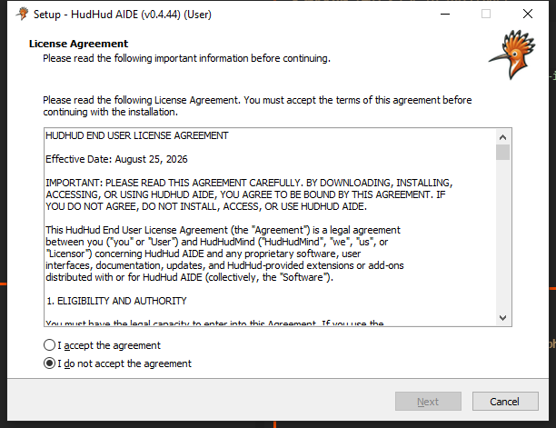
</p>

* Select **"I accept the agreement"** and click **Next**.

---

### Step 3: Select Destination Directory

Choose the folder where you want to install HudHud AIDE:

<p align="center">
  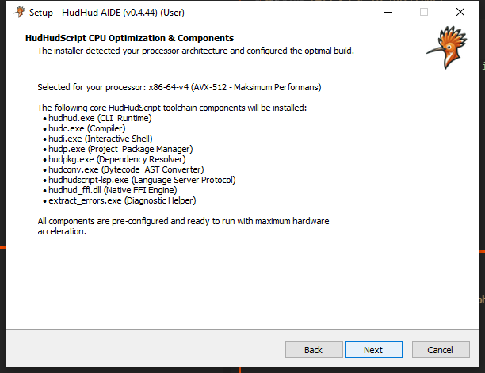
</p>

* Default installation directory:  
  `C:\Users\<User>\AppData\Local\Programs\HudHud AIDE` or `C:\Program Files\HudHud AIDE`
* Click **Browse...** if you wish to choose a custom directory, then click **Next**.

---

### Step 4: CPU Architecture & Optimization

HudHud AIDE includes hardware-optimized native binaries (`x86-64-v1` to `x86-64-v4`):

<p align="center">
  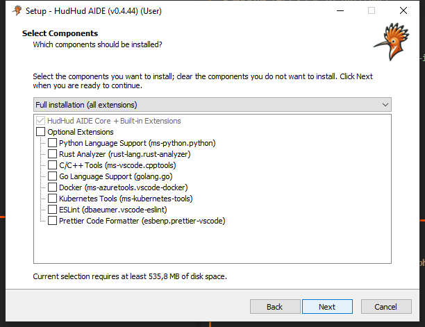
</p>

* The installer automatically probes your CPU capabilities (SSE4.2, AVX2, AVX-512) and pre-selects the optimal toolchain variant for maximum execution speed.
* Keep the recommended selection and click **Next**.

---

### Step 5: Select Components

Review the bundled components and tools to install:

<p align="center">
  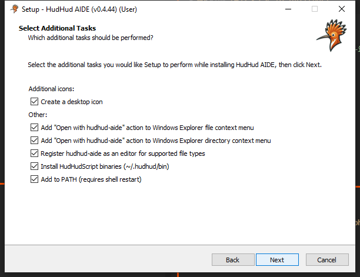
</p>

* Bundled components include the HudHud AIDE Core Editor, Visual Graph Engine (`.hudhudgraph`), Language Server Protocol (`hudhudscript-lsp`), Compiler (`hudc`), Runtime (`hudhud`), and REPL (`hudi`).
* Click **Next**.

---

### Step 6: Start Menu Folder

Configure your Start Menu shortcut group:

<p align="center">
  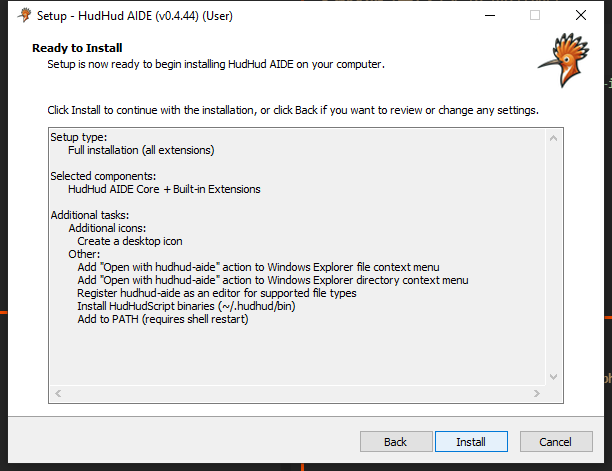
</p>

* Keep the default `HudHud AIDE` folder or choose another directory, then click **Next**.

---

### Step 7: Additional Tasks & PATH Configuration

Select additional system integration tasks:

<p align="center">
  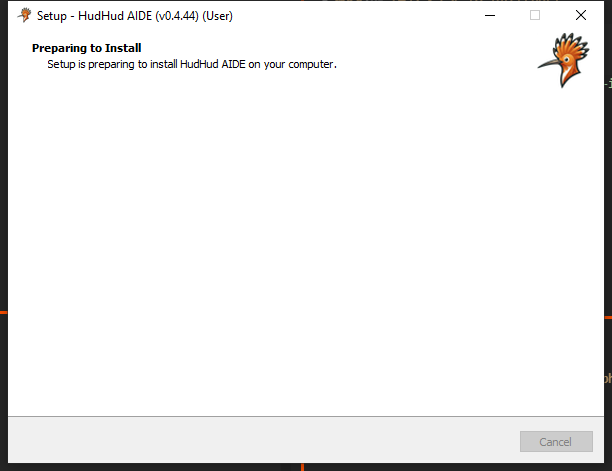
</p>

* Check **"Create a desktop shortcut"** for quick access.
* Ensure **"Add to PATH"** is selected so you can run `hudhud`, `hudc`, and `hudi` directly from any terminal.
* Check file association for **`.hud`** and **`.hudhudgraph`** files.
* Click **Next**.

---

### Step 8: Ready to Install Summary

Review your configuration before files are copied:

<p align="center">
  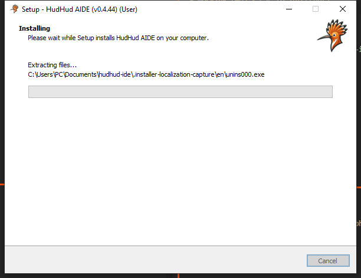
</p>

* Verify the destination path, selected CPU architecture, and shortcut settings.
* Click **Install** to begin extracting and copying files.

---

### Step 9: Installation Progress

The installer extracts and configures all components:

<p align="center">
  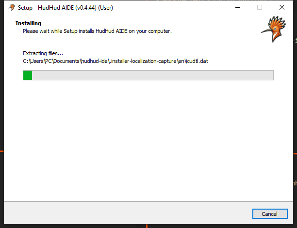
</p>

* The installer registers file handlers, sets environment variables, and verifies toolchain binaries.

---

### Step 10: Installation Finished & Launch

Once extraction and registration are complete:

<p align="center">
  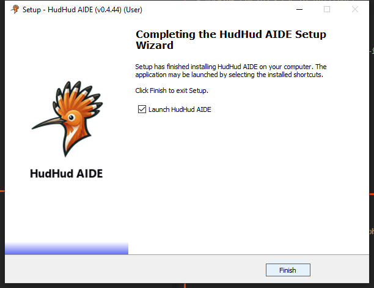
</p>

* Check **"Launch HudHud AIDE"** to start the IDE immediately.
* Click **Finish**.

> [!NOTE]
> When launching for the first time, HudHud AIDE will guide you through a 6-step onboarding wizard to set your theme, configure HudHud Code & AI agent settings, and initialize your workspace. See the [**Onboarding Guide (ONBOARDING.md)**](ONBOARDING.md) for details.

---

## Zero-Code CLI Installation & Language Flags

The Windows installer is built using Inno Setup and natively supports command-line switches:

### Language Selection Flags
| Flag | Description |
| :--- | :--- |
| `/LANG=en` or `/LANG=english` | Force installer interface to **English** |
| `/LANG=tr` or `/LANG=turkish` | Force installer interface to **Turkish** |

### Silent & Automated Installation
| Flag | Description |
| :--- | :--- |
| `/SILENT` | Displays the progress wizard without asking interactive questions |
| `/VERYSILENT` | Completely unattended background installation |
| `/DIR="C:\Path\To\Install"` | Overrides the default installation directory |
| `/ALLUSERS` | Installs for all users on the computer |
| `/CURRENTUSER` | Installs only for the current user |
| `/TASKS="desktopicon"` | Creates desktop shortcut automatically |

#### Example Command:
```powershell
# Run installer in English silently into a custom directory:
.\hudhud-aide-v0.4.46-win-x64-setup.exe /LANG=en /DIR="C:\Dev\HudHudAIDE" /SILENT
```

---

## Running HudHud AIDE in English or Turkish

Launch HudHud AIDE in any supported display language directly from the command line:

```powershell
# Launch in English:
hudhud-aide --locale=en

# Launch in Turkish:
hudhud-aide --locale=tr
```

You can also change the display language inside the IDE:
1. Press `Ctrl + Shift + P` (or `Cmd + Shift + P` on macOS) to open the Command Palette.
2. Type `Configure Display Language`.
3. Select **English** or **Türkçe (Turkish)** and restart when prompted.

---

## Linux Installation Guide (GUI & Console Modes)

The Linux installer is provided in English and supports both an interactive **Graphical (GUI)** installer and a terminal-based **Console** installer.

### Linux Prerequisites
* 64-bit Linux distribution (Ubuntu 20.04+, Debian 11+, Fedora 36+, Arch Linux, Kali Linux, openSUSE)
* GLIBC 2.31 or newer
* GTK 3 (for GUI mode) or standard terminal (for Console mode)

### Downloading & Making Executable

1. Download the Linux installer:
   ```bash
   wget https://github.com/HudHudMind/hudhud-aide/releases/download/v0.4.46/hudhud-aide-v0.4.46-linux-x64-installer.run
   ```
2. Make the installer executable:
   ```bash
   chmod +x hudhud-aide-v0.4.46-linux-x64-installer.run
   ```

---

### Option A: Linux GUI Interactive Walkthrough

If running in an X11 or Wayland desktop environment (GNOME, KDE Plasma, XFCE), simply run:
```bash
./hudhud-aide-v0.4.46-linux-x64-installer.run
```

#### Step 1: Welcome & License Agreement
<p align="center">
  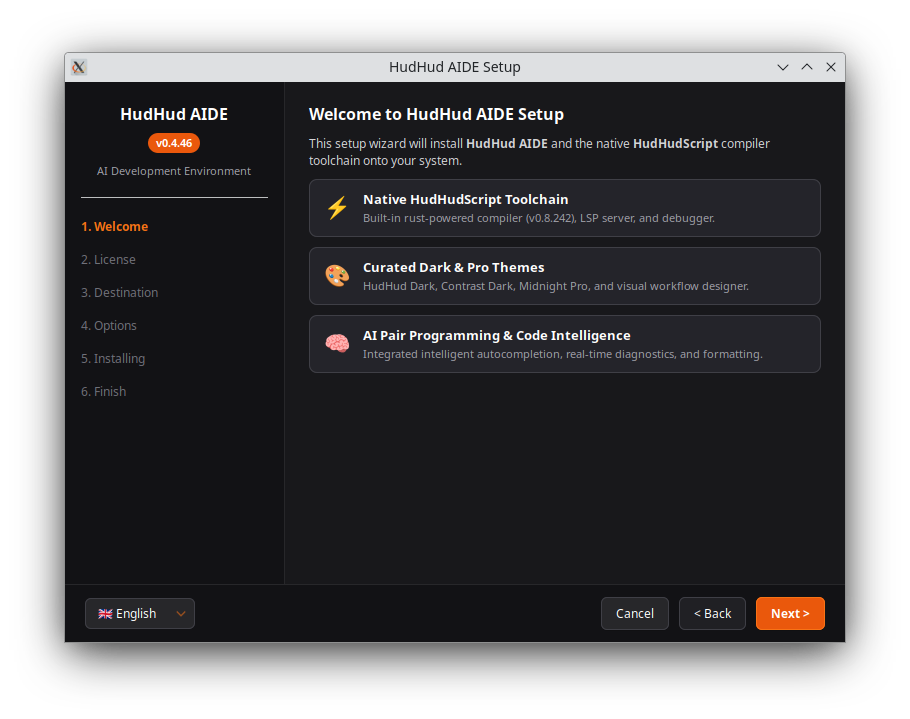
</p>

* Review the license terms and click **Next**.

#### Step 2: Destination Directory
<p align="center">
  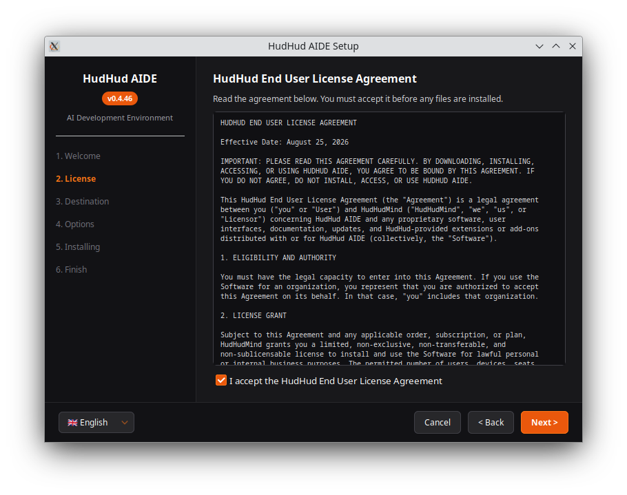
</p>

* Select the target directory (default: `~/.local/share/hudhud-aide` or `/opt/hudhud-aide`) and click **Next**.

#### Step 3: Components & Architecture Optimization
<p align="center">
  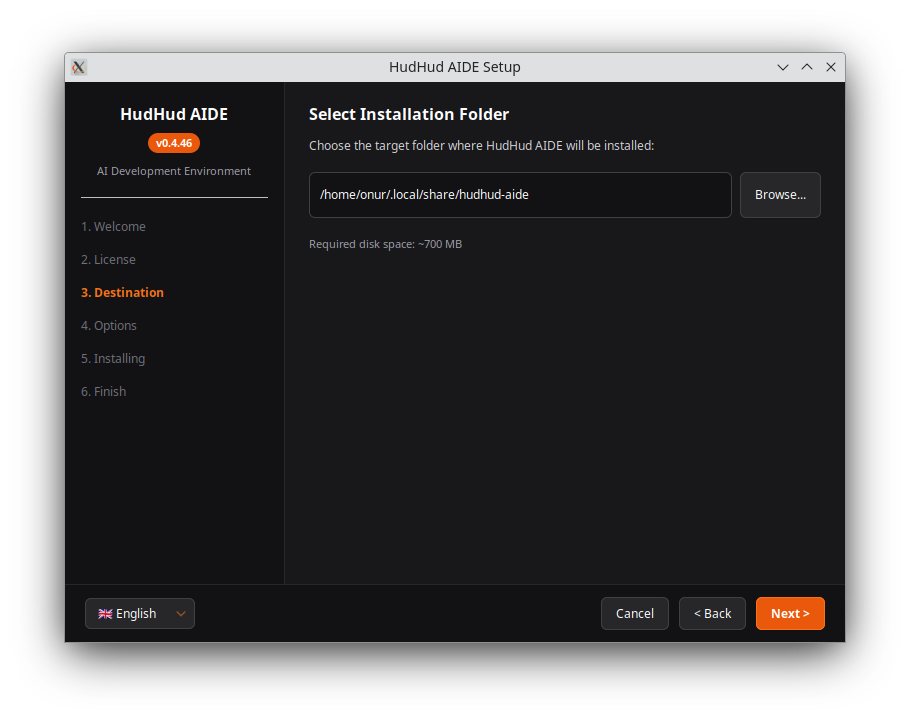
</p>

* The installer detects your CPU instruction set (`v1` to `v4`) and configures native hardware acceleration.

#### Step 4: Ready to Install Summary
<p align="center">
  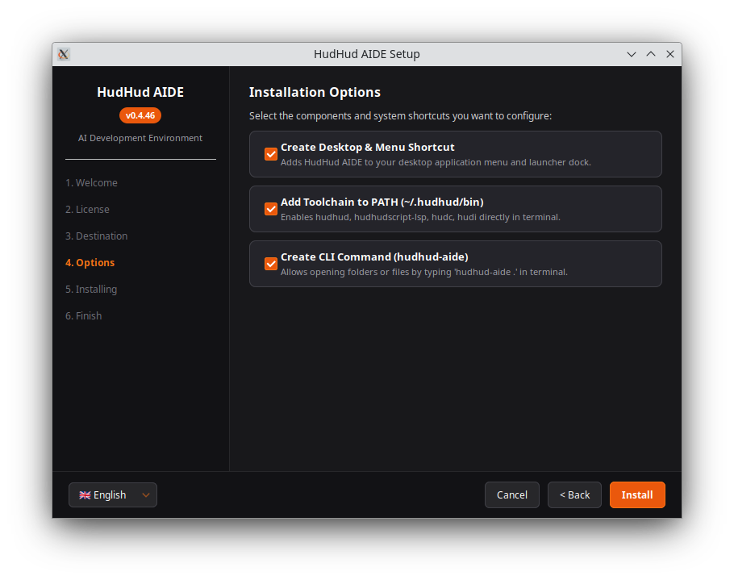
</p>

* Review your settings and click **Install**.

#### Step 5: Installation Progress
<p align="center">
  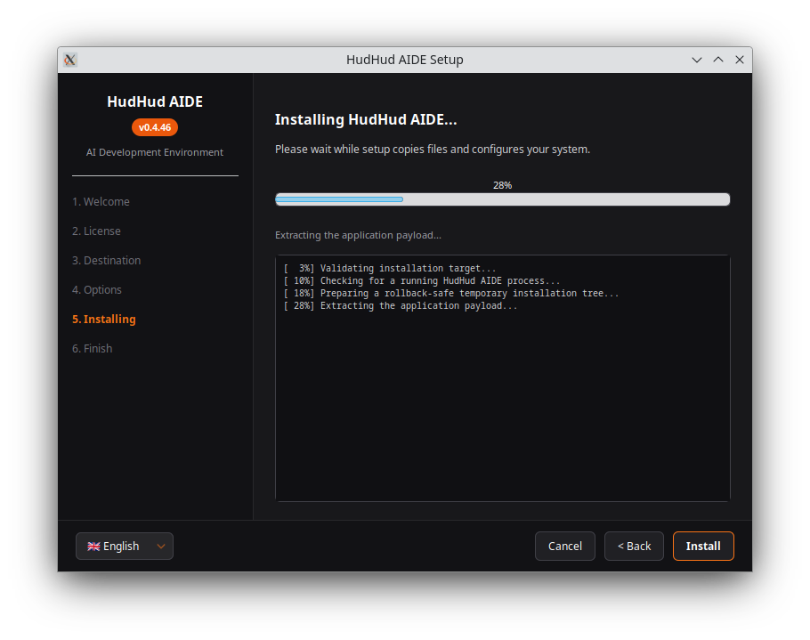
</p>

* Files are unpacked and desktop `.desktop` menu entries are created.

#### Step 6: Installation Completed
<p align="center">
  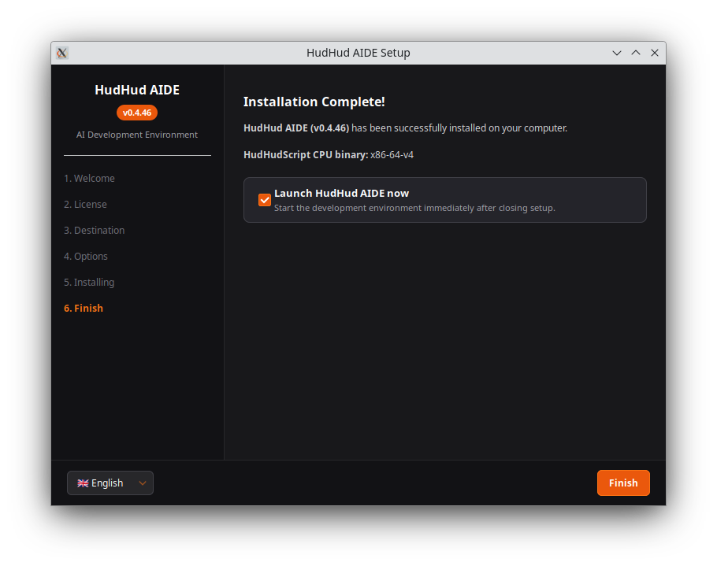
</p>

* Check **"Launch HudHud AIDE"** and click **Finish**.

---

### Option B: Linux Console / Terminal Mode Walkthrough

For headless servers, SSH sessions, or minimal installations, run the installer in console mode:
```bash
./hudhud-aide-v0.4.46-linux-x64-installer.run --mode console
```

#### Step 1: Terminal License Agreement
<p align="center">
  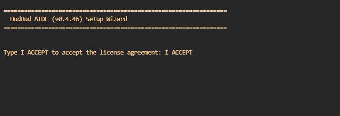
</p>

* Press `Enter` to scroll through the license and type `yes` to accept.

#### Step 2: Component Selection & Extraction Progress
<p align="center">
  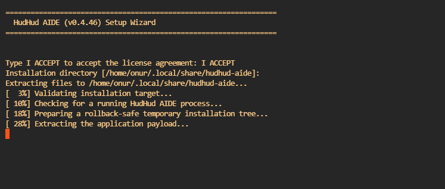
</p>

* Select installation prefix and view extraction progress in real time.

#### Step 3: Setup Completion & PATH Configuration
<p align="center">
  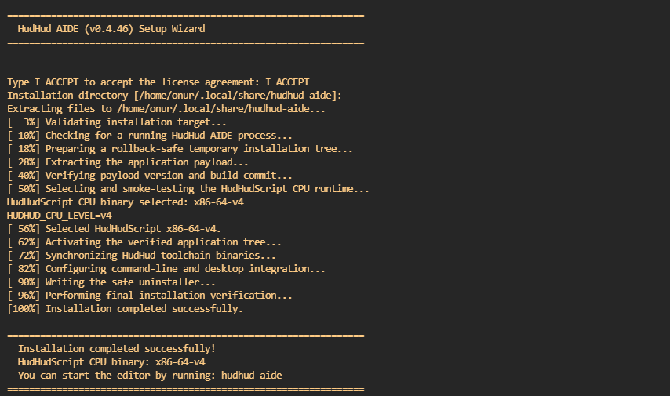
</p>

* The installer confirms successful setup and provides PATH export instructions:
  ```bash
  export PATH="$HOME/.local/share/hudhud-aide/bin:$PATH"
  ```

---

## Troubleshooting & FAQ

### Q: Why did Windows Defender SmartScreen show a warning?
**A:** The application binary is newly released and unsigned. Click **"More info"** and then **"Run anyway"**.

### Q: How do I verify that the toolchain is working?
**A:** Open a terminal / PowerShell window and run:
```powershell
hudhud --version
hudc --version
hudi --version
```

### Q: Where do I go after installing?
**A:** Follow the [**Onboarding Guide (ONBOARDING.md)**](ONBOARDING.md) to complete your initial environment and AI agent setup.

---
*© 2026 HudHud Script. All rights reserved.*
