# HudHud AIDE Kurulum Kılavuzu

<p align="center">
  <b>Diller:</b> <a href="../INSTALL.md">English</a> | <b>Türkçe</b>
</p>

<p align="center">
  <a href="README.tr.md"><b>🏠 Ana README</b></a> | 
  <a href="ONBOARDING.tr.md"><b>🚀 İlk Çalıştırma & Başlangıç</b></a>
</p>

---

Bu kılavuz, **HudHud AIDE**'in (Otonom Akıllı Geliştirme Ortamı) **Windows** ve **Linux** işletim sistemlerine adım adım kurulumunu; kurulum sihirbazı ekran görüntüleri, donanım optimizasyon seçenekleri, GUI & Konsol modları ve gelişmiş komut satırı parametreleriyle birlikte sunmaktadır.

---

## İçindekiler
1. [Sistem Gereksinimleri](#sistem-gereksinimleri)
2. [Windows Görsel Kurulum Adımları](#windows-görsel-kurulum-adımları)
   - [Adım 1: İndirme ve SmartScreen Onayı](#adım-1-indirme-ve-smartscreen-onayı)
   - [Adım 2: Hoş Geldiniz Kurulum Sihirbazı](#adım-2-hoş-geldiniz-kurulum-sihirbazı)
   - [Adım 3: Hedef Kurulum Dizinini Seçme](#adım-3-hedef-kurulum-dizinini-seçme)
   - [Adım 4: İşlemci Mimarisi ve Donanım Optimizasyonu](#adım-4-işlemci-mimarisi-ve-donanım-optimizasyonu)
   - [Adım 5: Başlat Menüsü ve Ek Görevler](#adım-5-başlat-menüsü-ve-ek-görevler)
   - [Adım 6: Kuruluma Hazır Özeti](#adım-6-kuruluma-hazır-özeti)
   - [Adım 7: Kurulum İlerlemesi](#adım-7-kurulum-ilerlemesi)
   - [Adım 8: Kurulumun Tamamlanması ve Başlatma](#adım-8-kurulumun-tamamlanması-ve-başlatma)
3. [Kodsuz Komut Satırı (CLI) Kurulumu ve Dil Parametreleri](#kodsuz-komut-satırı-cli-kurulumu-ve-dil-parametreleri)
4. [HudHud AIDE'yi Türkçe veya İngilizce Çalıştırma](#hudhud-aideyi-türkçe-veya-ingilizce-çalıştırma)
5. [Linux Kurulum Kılavuzu (GUI ve Konsol Modları)](#linux-kurulum-kılavuzu-gui-ve-konsol-modları)
   - [Linux Önkoşulları](#linux-önkoşulları)
   - [İndirme ve Çalıştırma İzni](#i̇ndirme-ve-çalıştırma-i̇zni)
   - [Seçenek A: Linux Grafiksel (GUI) Kurulum Rehberi](#seçenek-a-linux-grafiksel-gui-kurulum-rehberi)
   - [Seçenek B: Linux Konsol / Terminal Kurulum Rehberi](#seçenek-b-linux-konsol--terminal-kurulum-rehberi)
6. [Sorun Giderme ve Sıkça Sorulan Sorular (SSS)](#sorun-giderme-ve-sıkça-sorulan-sorular-sss)

---

## Sistem Gereksinimleri

| Özellik | Minimum | Önerilen |
| :--- | :--- | :--- |
| **İşletim Sistemi** | Windows 10 / 11 (64-bit) veya Linux x86_64 | Windows 10 / 11 (64-bit) / Ubuntu 22.04+ LTS |
| **İşlemci (CPU)** | 64-bit Intel / AMD (`x86-64-v1` uyumlu işlemciler) | Çok çekirdekli `x86-64-v1` .. `v4` (SSE4.2 / AVX2 / AVX-512) |
| **Bellek (RAM)** | 4 GB | 8 GB veya daha fazlası |
| **Disk Alanı** | 1.5 GB boş alan | 3 GB boş alan (SSD önerilir) |

---

## Windows Görsel Kurulum Adımları

### Adım 1: İndirme ve SmartScreen Onayı

1. En güncel kurulum dosyasını indirin: [`hudhud-aide-v0.4.46-win-x64-setup.exe`](https://github.com/HudHudMind/hudhud-aide/releases/download/v0.4.46/hudhud-aide-v0.4.46-win-x64-setup.exe).
2. Windows Defender SmartScreen *"Windows kişisel bilgisayarınızı korudu"* uyarısı verirse:
   - **"Ek bilgi"** (*More info*) bağlantısına tıklayın.
   - **"Yine de çalıştır"** (*Run anyway*) düğmesine tıklayarak kurulum sihirbazını başlatın.

> [!NOTE]
> Kurulum aracı işletim sisteminizin varsayılan dilini ve işlemci özelliklerini otomatik olarak tespit eder. Kurulumu doğrudan Türkçe veya İngilizce olarak başlatmak için [CLI Parametreleri](#kodsuz-komut-satırı-cli-kurulumu-ve-dil-parametreleri) bölümüne bakabilirsiniz.

---

### Adım 2: Hoş Geldiniz Kurulum Sihirbazı

Kurulum dosyası açıldığında karşınıza hoş geldiniz ekranı gelecektir:

<p align="center">
  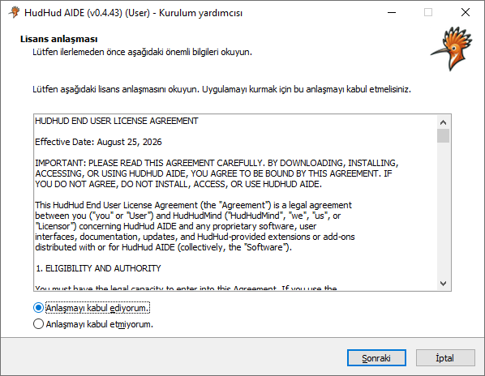
</p>

* Devam etmek için **İleri** butonuna tıklayın.

---

### Adım 3: Hedef Kurulum Dizinini Seçme

HudHud AIDE'in kurulacağı klasörü belirleyin:

<p align="center">
  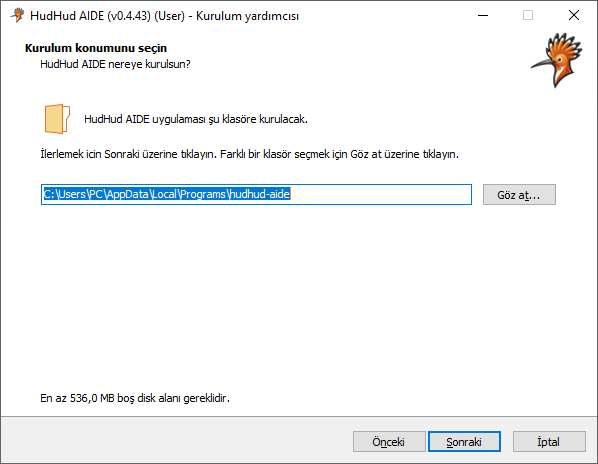
</p>

* Varsayılan kurulum dizini:  
  `C:\Users\<Kullanıcı>\AppData\Local\Programs\HudHud AIDE` veya `C:\Program Files\HudHud AIDE`
* Farklı bir dizin seçmek isterseniz **Gözat...** butonuna tıklayabilir, ardından **İleri** butonuna basabilirsiniz.

> [!TIP]
> Seçtiğiniz dizin daha önceki bir kurulumdan dolayı zaten mevcutsa kurulum sihirbazı onay iletişim kutusu gösterecektir. Üzerine yazmak veya güncellemek için **Evet** butonuna tıklayın:
> <p align="center">
>   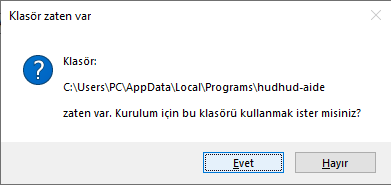
> </p>

---

### Adım 4: İşlemci Mimarisi ve Donanım Optimizasyonu

HudHud AIDE, donanım seviyesinde optimize edilmiş yerel araç takımları (`x86-64-v1` ile `x86-64-v4` arası) içerir:

<p align="center">
  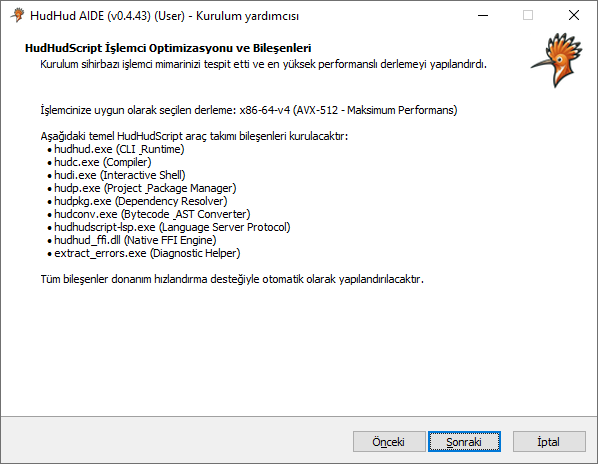
</p>

* Kurulum sihirbazı işlemcinizin özelliklerini (SSE4.2, AVX2, AVX-512) otomatik olarak analiz eder ve en yüksek performans sağlayacak varyantı seçili olarak getirir.
* Önerilen seçimi koruyarak **İleri** butonuna tıklayın.

---

### Adım 5: Başlat Menüsü ve Ek Görevler

Başlat menüsü klasörünü ve kısayol tercihlerinizi yapılandırın:

<p align="center">
  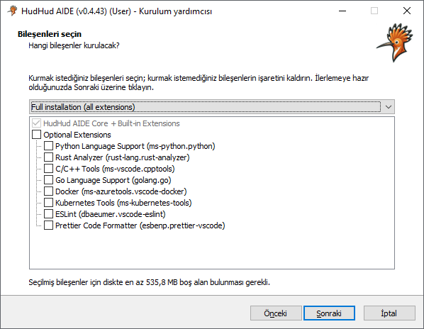
</p>

Masaüstü kısayolu, dosya uzantı eşleştirmeleri (`.hud`, `.hudhudgraph`) ve PATH ortam değişkeni kaydı gibi ek görevleri belirleyin:

<p align="center">
  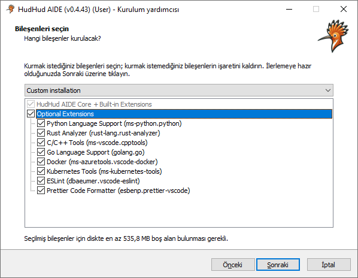
</p>

* Hızlı erişim için **"Masaüstü simgesi oluştur"** seçeneğini işaretleyebilirsiniz.
* Terminalden `hudhud`, `hudc`, `hudi` komutlarını doğrudan çalıştırabilmek için **"PATH ortam değişkenine ekle"** seçeneğinin işaretli olduğundan emin olun.
* **İleri** butonuna tıklayın.

---

### Adım 6: Kuruluma Hazır Özeti

Dosyalar kopyalanmadan önce seçtiğiniz yapılandırmayı kontrol edin:

<p align="center">
  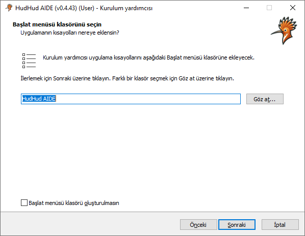
</p>

* Hedef dizin, seçilen işlemci mimarisi ve kısayol ayarlarını gözden geçirin.
* Dosyaların kopyalanmasını başlatmak için **Kur** butonuna tıklayın.

---

### Adım 7: Kurulum İlerlemesi

Kurulum sihirbazı tüm bileşenleri ayıklar ve yapılandırır:

<p align="center">
  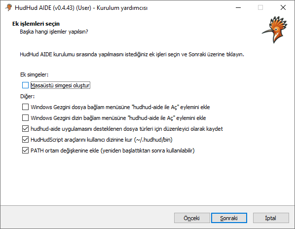
</p>

<p align="center">
  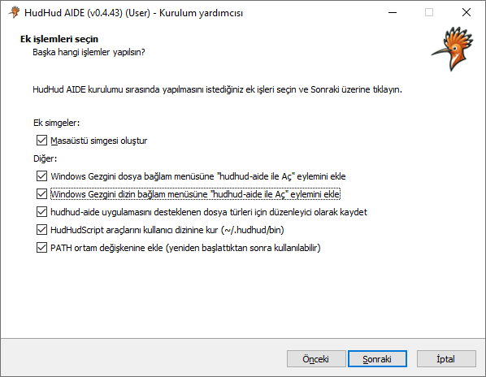
</p>

* Kurulum sihirbazı donanım optimizasyon düzeyinizi doğrular ve sistem dosya işleyicilerini kaydeder.
* İlerleme çubuğu %100 olana kadar birkaç saniye bekleyin.

---

### Adım 8: Kurulumun Tamamlanması ve Başlatma

Bileşenler kopyalanıp kayıt işlemleri tamamlandıktan sonra:

<p align="center">
  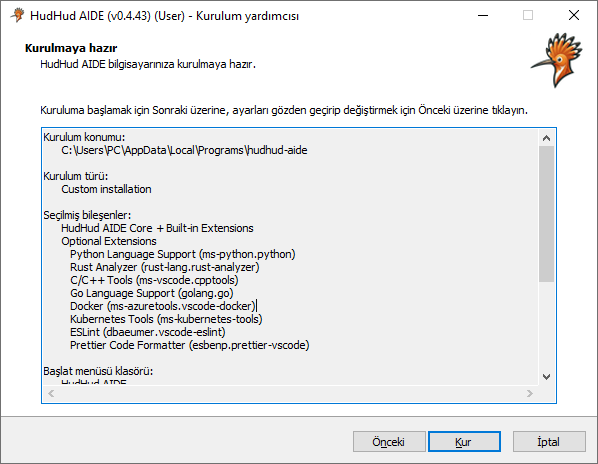
</p>

<p align="center">
  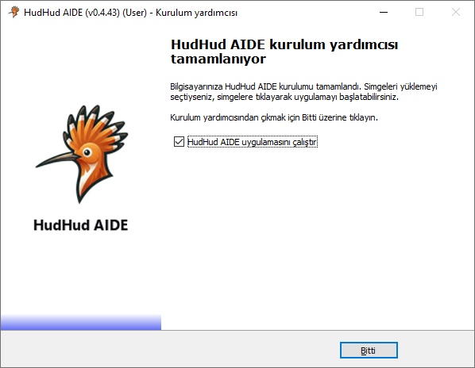
</p>

* Ortamı hemen başlatmak için **"HudHud AIDE Çalıştır"** seçeneğini işaretli bırakın.
* **Bitti** butonuna tıklayarak sihirbazı kapatın.

> [!NOTE]
> Uygulamayı ilk kez açtığınızda, tema, YZ kodlama ajanı ve çalışma alanı tercihlerinizi belirlemenizi sağlayan 6 adımlı hızlı başlangıç sihirbazı karşılayacaktır. Ayrıntılar için [**Başlangıç Kılavuzu (ONBOARDING.tr.md)**](ONBOARDING.tr.md) sayfasına bakın.

---

## Kodsuz Komut Satırı (CLI) Kurulumu ve Dil Parametreleri

Kurulum paketi Inno Setup altyapısıyla hazırlandığı için herhangi bir kod değişikliği gerektirmeden standart komut satırı parametrelerini destekler:

### Dil Seçim Parametreleri
| Parametre | Açıklama |
| :--- | :--- |
| `/LANG=tr` veya `/LANG=turkish` | Kurulum arayüzünü doğrudan **Türkçe** olarak başlatır |
| `/LANG=en` veya `/LANG=english` | Kurulum arayüzünü doğrudan **İngilizce** olarak başlatır |

### Sessiz ve Otomatik Kurulum Parametreleri
| Parametre | Açıklama |
| :--- | :--- |
| `/SILENT` | Etkileşimli soru sormadan yalnızca ilerleme çubuğunu göstererek kurar |
| `/VERYSILENT` | Tamamen arka planda, pencere açmadan sessizce kurar |
| `/DIR="C:\Hedef\Dizin"` | Varsayılan kurulum dizinini geçersiz kılarak belirtilen konuma kurar |
| `/ALLUSERS` | Bilgisayardaki tüm kullanıcılar için kurulum yapar |
| `/CURRENTUSER` | Yalnızca mevcut oturum açmış kullanıcı için kurar |
| `/TASKS="desktopicon"` | Otomatik olarak masaüstü simgesi oluşturur |

#### Örnek Komut (PowerShell / Komut İstemi):
```powershell
# Türkçe arayüzle, sessiz modda özel bir dizine kurmak için:
.\hudhud-aide-v0.4.46-win-x64-setup.exe /LANG=tr /DIR="C:\Gelistirme\HudHudAIDE" /SILENT
```

---

## HudHud AIDE'yi Türkçe veya İngilizce Çalıştırma

HudHud AIDE'yi kaynak kodlarda değişiklik yapmadan doğrudan komut satırından dilediğiniz arayüz diliyle başlatabilirsiniz:

```powershell
# Türkçe olarak başlatma:
hudhud-aide --locale=tr

# İngilizce olarak başlatma:
hudhud-aide --locale=en
```

Arayüz dilini IDE içerisinden de dilediğiniz an değiştirebilirsiniz:
1. `Ctrl + Shift + P` (veya macOS üzerinde `Cmd + Shift + P`) kısayolu ile Komut Paletini açın.
2. `Configure Display Language` yazın ve seçin.
3. **Türkçe (Turkish)** veya **English** seçeneğini belirleyin ve istendiğinde IDE'yi yeniden başlatın.

---

## Linux Kurulum Kılavuzu (GUI ve Konsol Modları)

> [!NOTE]
> Linux kurulumu hem etkileşimli **Grafiksel (GUI)** arayüzle (Türkçe ve İngilizce) hem de uçbirim/terminal tabanlı **Konsol (CLI)** moduyla tam uyumludur.

### Linux Önkoşulları
* 64-bit Linux dağıtımı (Ubuntu 20.04+, Debian 11+, Fedora 36+, Arch Linux, Kali Linux, openSUSE)
* GLIBC 2.31 veya daha yenisi
* Grafiksel kurulum için GTK 3 veya konsol kurulumu için standart uçbirim

### İndirme ve Çalıştırma İzni

1. Linux kurulum paketini indirin:
   ```bash
   wget https://github.com/HudHudMind/hudhud-aide/releases/download/v0.4.46/hudhud-aide-v0.4.46-linux-x64-installer.run
   ```
2. Dosyaya çalıştırma izni verin:
   ```bash
   chmod +x hudhud-aide-v0.4.46-linux-x64-installer.run
   ```

---

### Seçenek A: Linux Grafiksel (GUI) Kurulum Rehberi

Masaüstü ortamında (GNOME, KDE Plasma, XFCE vb.) kurulum dosyasını doğrudan çalıştırın:
```bash
./hudhud-aide-v0.4.46-linux-x64-installer.run
```

#### Adım 1: Hoş Geldiniz ve Lisans Sözleşmesi
<p align="center">
  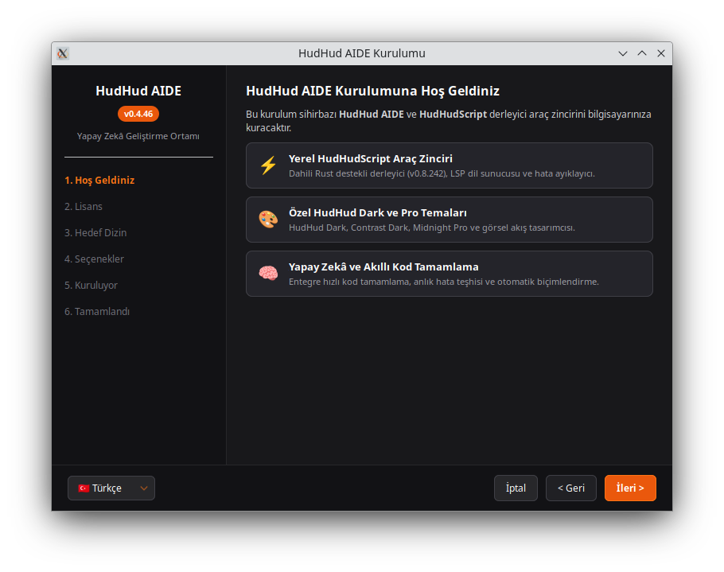
</p>

* Lisans şartlarını inceleyip **İleri** butonuna tıklayın.

#### Adım 2: Kurulum Dizinini Belirleme
<p align="center">
  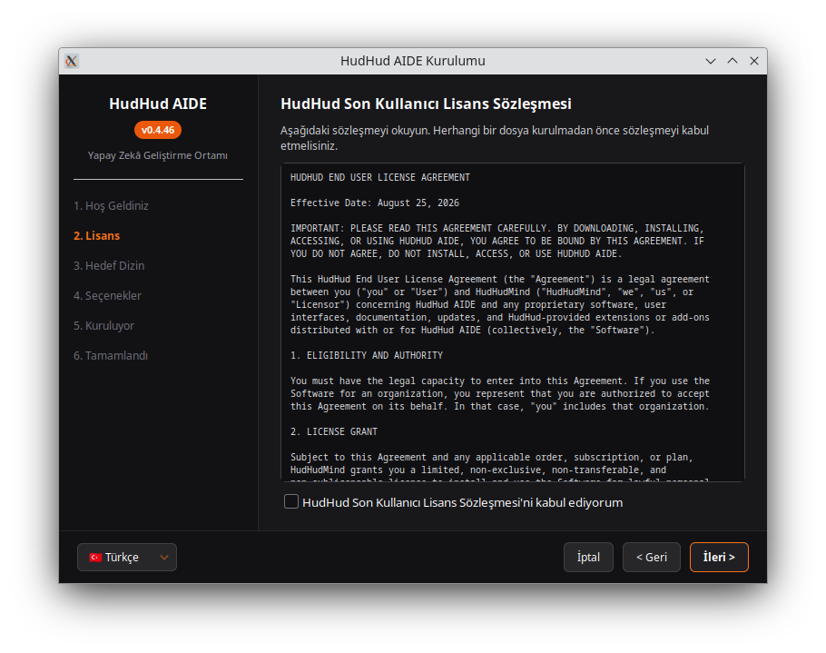
</p>

* Hedef klasörü seçin (varsayılan: `~/.local/share/hudhud-aide`) ve **İleri** butonuna tıklayın.

#### Adım 3: Bileşenler ve İşlemci Mimarisi Optimizasyonu
<p align="center">
  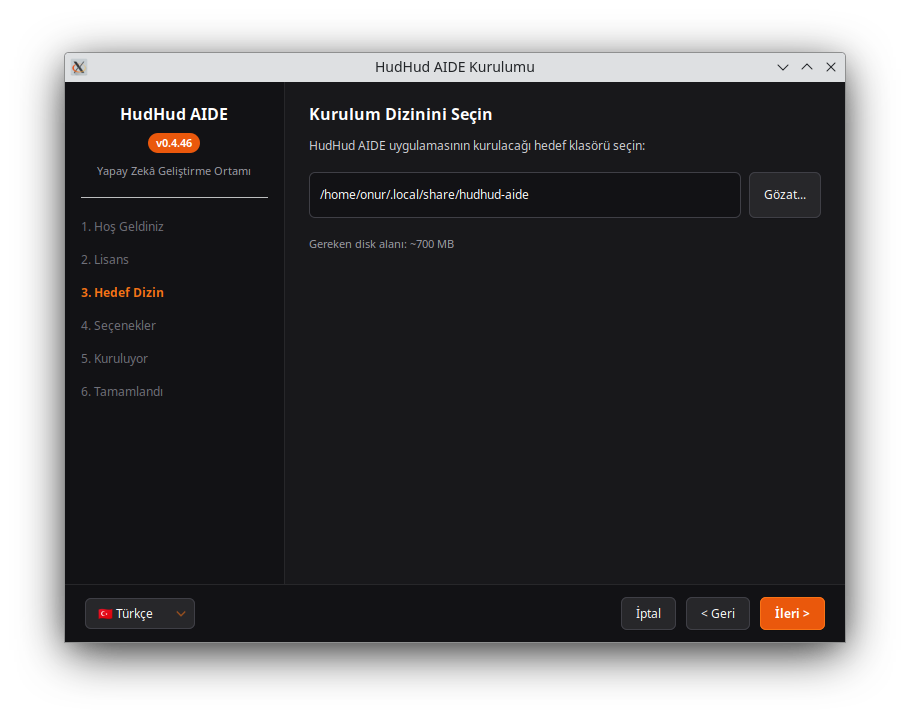
</p>

* Kurulum sihirbazı işlemcinizin özelliklerini (`v1` .. `v4`) tespit eder ve donanımsal ivmeyi etkinleştirir.

#### Adım 4: Kuruluma Hazır Özeti
<p align="center">
  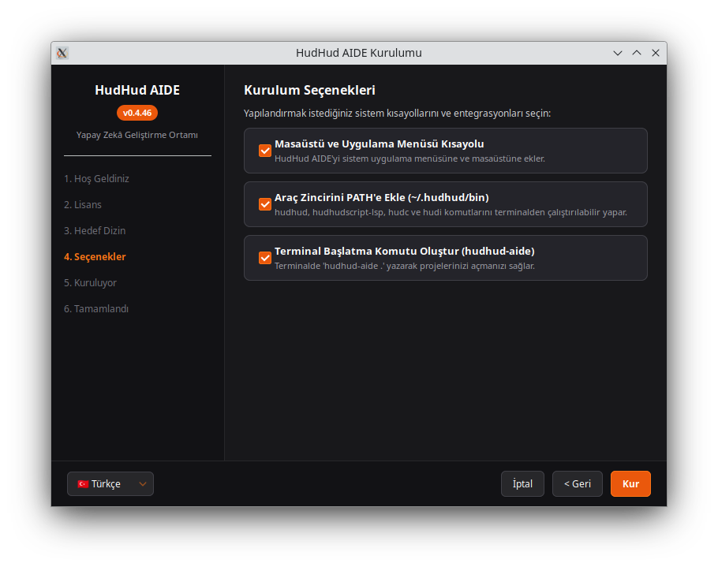
</p>

* Tercihlerinizi kontrol edin ve **Kur** butonuna tıklayın.

#### Adım 5: Kurulum İlerlemesi
<p align="center">
  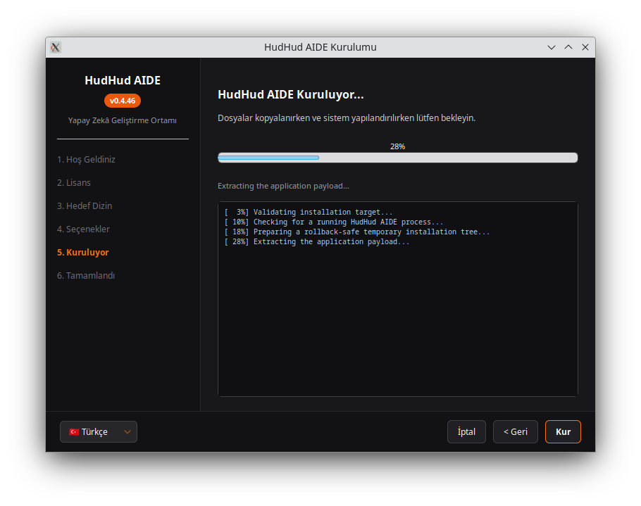
</p>

* Paketler açılır ve sistem `.desktop` menü kayıtları oluşturulur.

#### Adım 6: Kurulum Tamamlandı
<p align="center">
  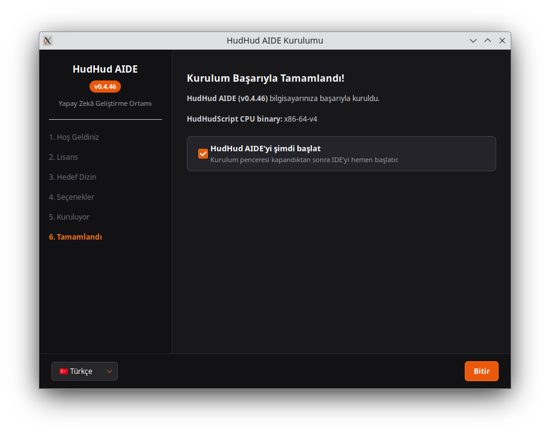
</p>

* **"HudHud AIDE Çalıştır"** seçeneğini işaretleyip **Bitti** butonuna tıklayın.

---

### Seçenek B: Linux Konsol / Terminal Kurulum Rehberi

Sunucularda, SSH oturumlarında veya başsız (headless) sistemlerde konsol modunda çalıştırmak için:
```bash
./hudhud-aide-v0.4.46-linux-x64-installer.run --mode console
```

#### Adım 1: Terminalde Lisans Onayı
<p align="center">
  
</p>

* Lisansı okumak için `Enter` tuşuna basın ve onaylamak için `yes` yazın.

#### Adım 2: Dizin Seçimi ve Çıkarma İlerlemesi
<p align="center">
  
</p>

* Kurulum dizinini belirleyin ve terminaldeki çıkarma ilerlemesini takip edin.

#### Adım 3: Kurulumun Tamamlanması ve PATH Tanımı
<p align="center">
  
</p>

* Kurulum tamamlandığında ortam değişkeni komutu ekrana yazdırılır:
  ```bash
  export PATH="$HOME/.local/share/hudhud-aide/bin:$PATH"
  ```

---

## Sorun Giderme ve Sıkça Sorulan Sorular (SSS)

### S: Windows Defender SmartScreen neden uyarı verdi?
**C:** Kurulum ikilisi yeni yayınlandığı ve henüz geniş kitlelerce indirilmediği için Windows Defender bu uyarıyı verir. **"Ek bilgi"** ve ardından **"Yine de çalıştır"** butonuna basarak güvenle kurabilirsiniz.

### S: Araç takımının çalıştığını nasıl doğrularım?
**C:** Bir terminal / PowerShell penceresi açın ve şu komutları çalıştırın:
```powershell
hudhud --version
hudc --version
hudi --version
```

### S: Kurulumdan sonra ne yapmalıyım?
**C:** İlk ortam ve YZ ajan yapılandırmanızı tamamlamak için [**Başlangıç Kılavuzu (ONBOARDING.tr.md)**](ONBOARDING.tr.md) belgesini inceleyin.

---
*© 2026 HudHud Script. Tüm hakları saklıdır.*
