# HudHud AIDE İlk Çalıştırma ve Başlangıç Kılavuzu

<p align="center">
  <b>Diller:</b> <a href="../ONBOARDING.md">English</a> | <b>Türkçe</b>
</p>

<p align="center">
  <a href="README.tr.md"><b>🏠 Ana README</b></a> | 
  <a href="INSTALL.tr.md"><b>📖 Kurulum Kılavuzu</b></a>
</p>

---

**HudHud AIDE**'e (Otonom Akıllı Geliştirme Ortamı) hoş geldiniz! HudHud AIDE'i ilk kez başlattığınızda, ortamı tercihlerinize göre uyarlamanızı, yapay zekâ kodlama ajanınızı yapılandırmanızı, donanıma göre optimize edilmiş araç takımlarını doğrulamanızı ve ilk projenizi başlatmanızı sağlayan 6 adımlı sezgisel bir başlangıç sihirbazı sizi karşılar.

Bu kılavuz, ekran görüntüleri ve açıklamalarla birlikte her adımda size rehberlik eder.

---

## İçindekiler
1. [6 Adımlı Başlangıç Sihirbazı](#6-adımlı-başlangıç-sihirbazı)
   - [Adım 1: Hoş Geldiniz ve Arayüz Dili](#adım-1-hoş-geldiniz-ve-arayüz-dili)
   - [Adım 2: Tema ve Görsel Görünüm](#adım-2-tema-ve-görsel-görünüm)
   - [Adım 3: YZ Kodlama Ajanı ve Model Yapılandırması](#adım-3-yz-kodlama-ajanı-ve-model-yapılandırması)
   - [Adım 4: Araç Takımı ve Donanım Motoru Doğrulaması](#adım-4-araç-takımı-ve-donanım-motoru-doğrulaması)
   - [Adım 5: Görsel Programlama ve Özellikler](#adım-5-görsel-programlama-ve-özellikler)
   - [Adım 6: Kodlamaya Hazır ve Proje Başlatma](#adım-6-kodlamaya-hazır-ve-proje-başlatma)
2. [YZ Kodlama Ajanını Yapılandırma](#yz-kodlama-ajanını-yapılandırma)
   - [Model Seçimi ve Öneriler](#model-seçimi-ve-öneriler)
   - [Ajan Ayarları ve Sağlayıcı Anahtarları](#ajan-ayarları-ve-sağlayıcı-anahtarları)
   - [Değişiklikleri İnceleme ve Onaylama](#değişiklikleri-i̇nceleme-ve-onaylama)
3. [Görsel Programlamayı Keşfetme (`.hudhudgraph`)](#görsel-programlamayı-keşfetme-hudhudgraph)
4. [İlk Projenizi Oluşturma](#i̇lk-projenizi-oluşturma)
5. [Temel Kısayollar](#temel-kısayollar)

---

## 6 Adımlı Başlangıç Sihirbazı

### Adım 1: Hoş Geldiniz ve Arayüz Dili

HudHud AIDE ilk kez açıldığında sizi başlangıç sihirbazı karşılar:

<p align="center">
  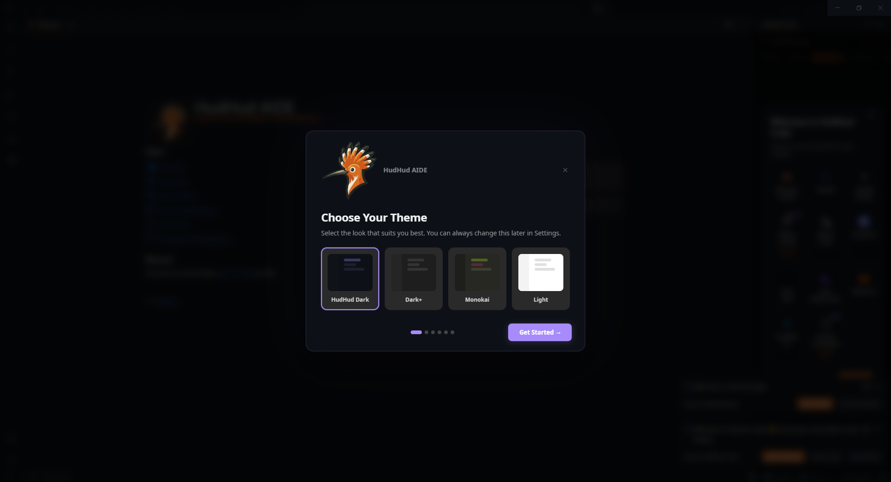
</p>

* Tercih ettiğiniz arayüz dilini seçin (**Türkçe** veya **English**).
* Dil ayarını daha sonra dilediğiniz an Komut Paletinden (`Ctrl + Shift + P` -> `Configure Display Language`) değiştirebilirsiniz.
* Devam etmek için **İleri** butonuna tıklayın.

---

### Adım 2: Tema ve Görsel Görünüm

Geliştirme ortamınızın renk temasını kişiselleştirin:

<p align="center">
  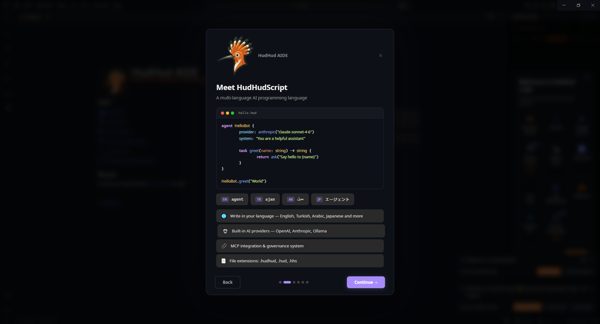
</p>

* Yerleşik temalar arasından seçim yapın:
  * **HudHud Koyu / Modern Koyu** (Uzun kodlama oturumlarında göz konforu için önerilir)
  * **Modern Açık**
  * **Yüksek Karşıtlıklı Koyu / Açık**
* HudHudScript (`.hud`), görsel grafik tanımları ve genel programlama dilleri (Python, Rust, C/C++, TypeScript) için sözdizimi vurgulamaları anında uyarlanır.
* **İleri** butonuna tıklayın.

---

### Adım 3: YZ Kodlama Ajanı ve Model Yapılandırması

Yerleşik otonom yapay zekâ kodlama asistanınızı yapılandırın:

<p align="center">
  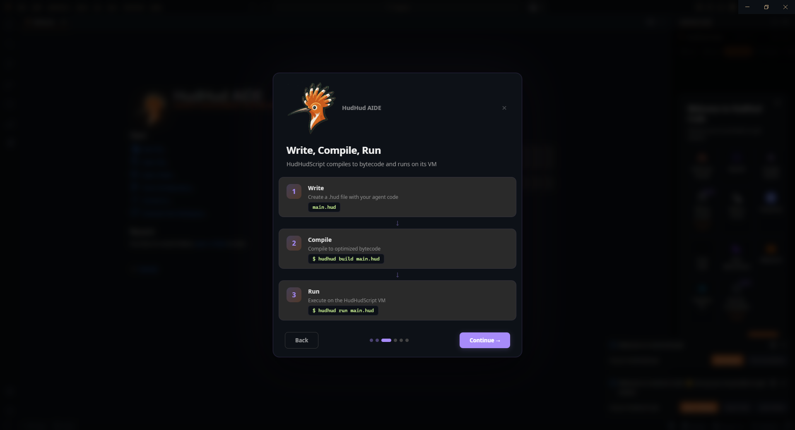
</p>

* **YZ Sağlayıcı Seçimi:** Tercih ettiğiniz YZ modellerine bağlanın (Anthropic Claude, OpenAI, Google Gemini, Ollama veya yerel LLM sunucuları).
* **API Anahtarı ve Uç Nokta:** API anahtarınızı güvenle girin veya özel sunucu URL'nizi belirtin. Anahtarlar işletim sisteminizin yerel kimlik kasasında güvenle saklanır.
* **Ajan Otonomluk Modu:** Ajanın dosya değişikliklerini uygulamadan önce onay istemesini veya tam otonom modda çalışmasını belirleyin.
* **İleri** butonuna tıklayın.

---

### Adım 4: Araç Takımı ve Donanım Motoru Doğrulaması

HudHud AIDE, yerel HudHudScript araç takımınızı otomatik olarak denetler:

<p align="center">
  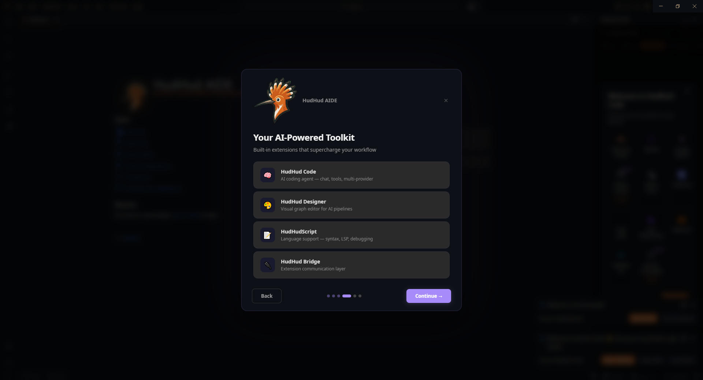
</p>

* Sistem temel araç takımı ikililerini kontrol eder:
  * `hudhud`: CLI çalışma zamanı ve yürütücü
  * `hudc`: Optimize edici yerel derleyici
  * `hudi`: Canlı etkileşimli REPL motoru
  * `hudhudscript-lsp`: Dil Sunucusu Protokolü (LSP) motoru
  * `hudhud_ffi`: C / Rust Yabancı Fonksiyon Arayüzü (FFI) çalışma zamanı
* Etkin donanım optimizasyon seviyesini (`x86-64-v1`, `v2`, `v3` veya `v4`) doğrular.
* **İleri** butonuna tıklayın.

---

### Adım 5: Görsel Programlama ve Özellikler

Yerleşik Görsel Programlama yeteneklerini keşfedin:

<p align="center">
  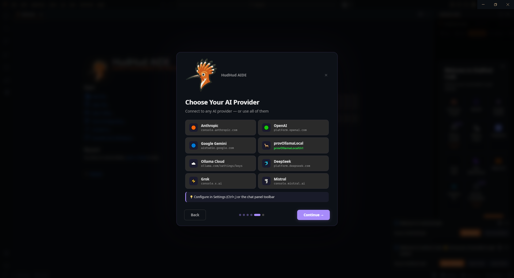
</p>

* **Düğüm Tabanlı Sistem:** Ajanik Programlama, Döngü Zincirleri ve Yönetişim politikaları için 240'tan fazla özelleştirilmiş düğüm türünü destekleyen görsel tasarım tuvali.
* **Hibrit Düzenleme:** Kaynak kod dosyaları (`.hud`) ile görsel grafik tasarımları (`.hudhudgraph`) arasında sorunsuz geçiş yapın.
* Son adıma geçmek için **İleri** butonuna tıklayın.

---

### Adım 6: Kodlamaya Hazır ve Proje Başlatma

Kurulum tamamlandı!

<p align="center">
  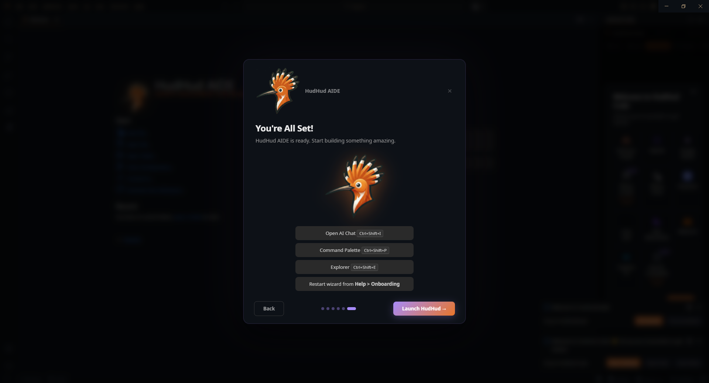
</p>

* Başlamak istediğiniz yöntemi seçin:
  * **Mevcut Klasörü / Çalışma Alanını Aç:** Var olan bir proje klasörünü açın.
  * **Yeni HudHud Projesi Oluştur:** Örnek şablonlarla yeni bir HudHudScript uygulaması veya görsel grafik projesi başlatın.
  * **Git Deposundan Klonla:** Uzak bir Git deposunu doğrudan IDE içerisine klonlayın.
* Ana editör çalışma alanına geçmek için **Kurulumu Tamamla** butonuna tıklayın.

---

## HudHud Code ve HudHud Coding Agent Yapılandırması

HudHud AIDE, hem etkileşimli sohbet ve akıl yürütme eşlikçisi (**HudHud Code**), hem de otonom çok dosyalı kod geliştirme ajanı (**HudHud Coding Agent**) barındırır.

### HudHud Code: İnteraktif Model Seçimi ve Sohbet

Önerilen hazır modeller arasından seçim yapabilir veya özel uç noktalar yapılandırabilirsiniz:

<p align="center">
  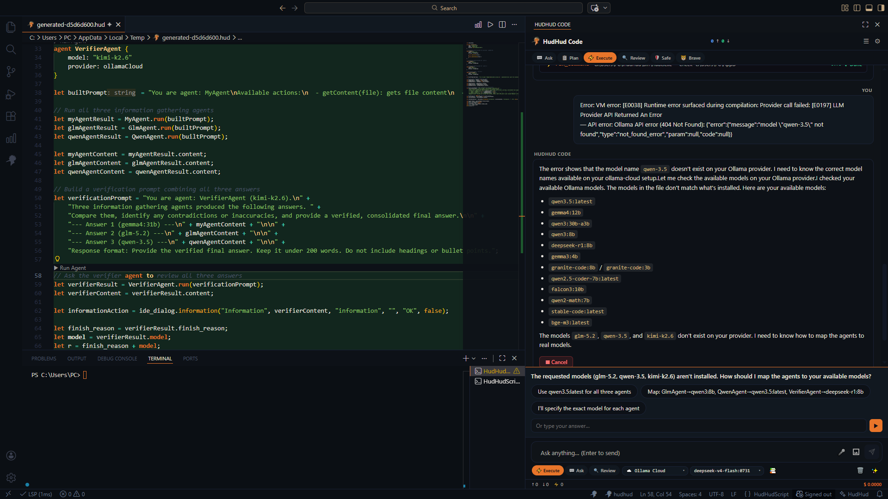
</p>

* Aktivite çubuğundaki **Ajan** simgesine tıklayarak veya `Ctrl + Shift + A` / `Cmd + Shift + A` kısayoluna basarak YZ kenar çubuğunu açın.
* Yüksek performanslı kodlama modellerinden (Claude 3.5 Sonnet, GPT-4o, Gemini 1.5 Pro, DeepSeek) birini veya yerel Ollama modelinizi seçin.

### HudHud Code: Ayarlar ve Sağlayıcı Anahtarları

Parametreleri, bağlam boyutunu, sistem yönergelerini ve sağlayıcı anahtarlarını yapılandırın:

<p align="center">
  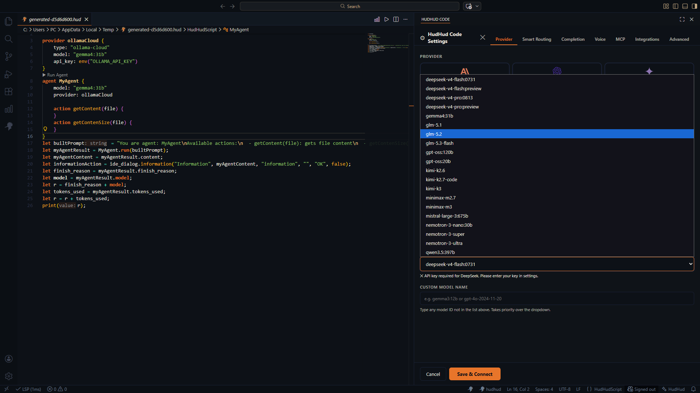
</p>

<p align="center">
  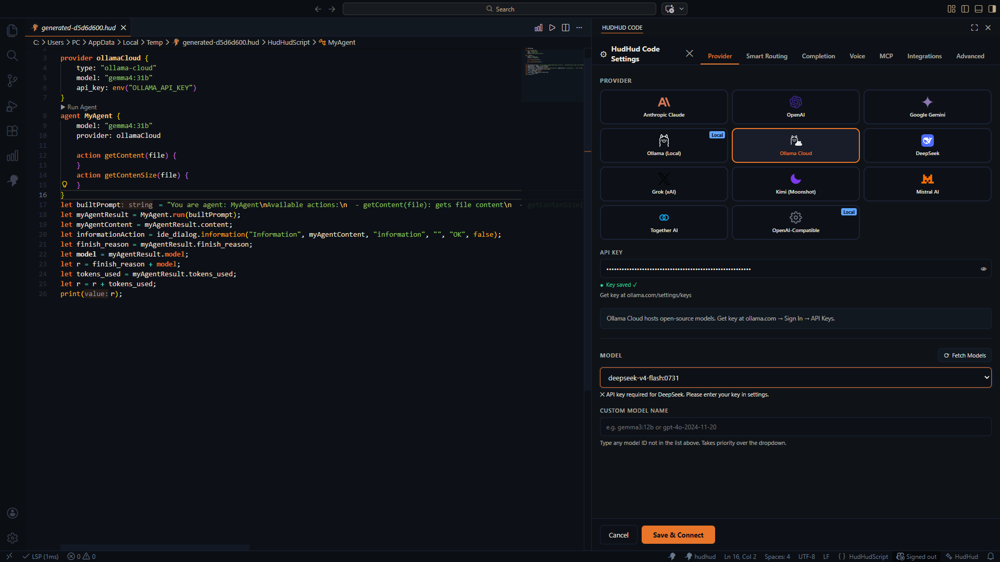
</p>

* Sıcaklık (temperature), maksimum belirteç (max tokens), akış yanıtı seçenekleri ve çalışma alanı dizinleme tercihlerini ayarlayın.
* Otomatik araç çağırma (dosya okuma, dosya düzenleme, terminal komutu çalıştırma, grafik üretme) izinlerini yönetin.

### HudHud Coding Agent: Çok Dosyalı Düzenlemeleri İnceleme ve Onaylama

Otonom kodlama ajanı dosya düzenlemeleri önerdiğinde değişiklikleri inceleme ve yönetme konusunda tam kontrole sahipsiniz:

<p align="center">
  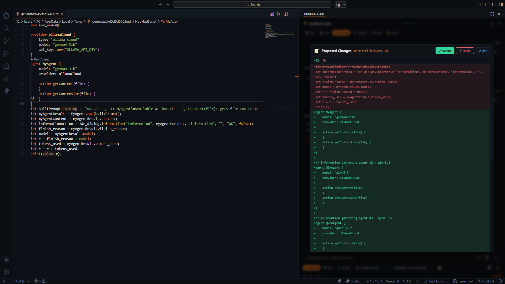
</p>

<p align="center">
  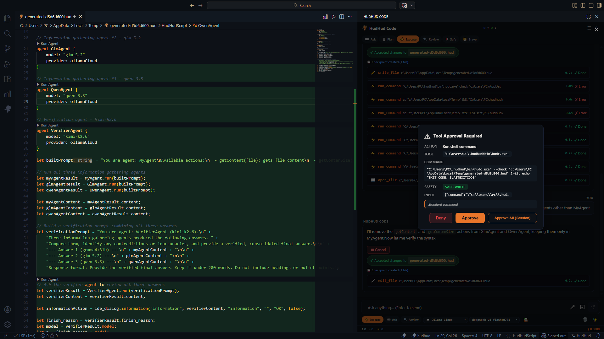
</p>

* **Etkileşimli Fark (Diff) Görünümü:** Eklenen satırları (yeşil) ve silinen satırları (kırmızı) satır içi olarak inceleyin.
* **Tek Tıkla Onay:** Değişiklikleri uygulamak için **Onayla** (*Approve*) butonuna, farklı bir çözüm talep etmek için **Reddet** (*Reject*) butonuna tıklayın.

---

## Görsel Programlamayı Keşfetme (`.hudhudgraph`)

Görsel programlama; çoklu ajan iş akışlarını, mantık döngülerini ve yönetişim kurallarını sürükle-bırak düğümlerle modellemenizi sağlar:

<p align="center">
  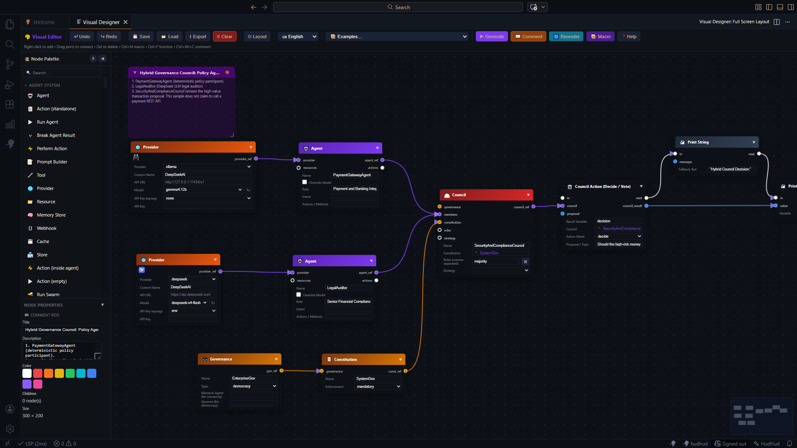
</p>

<p align="center">
  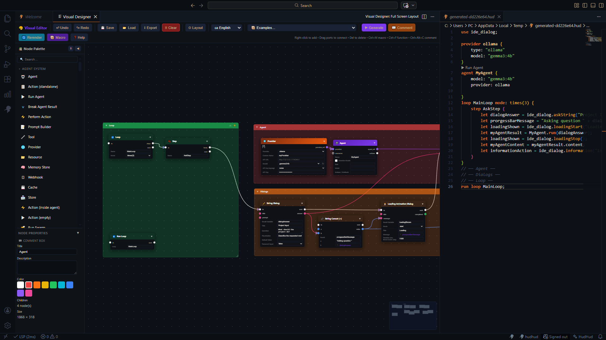
</p>

1. Herhangi bir `.hudhudgraph` dosyası oluşturun veya açın.
2. Paletten düğümleri tuvale sürükleyin (Ajanlar, Eylemler, Döngü Denetleyicileri, Politikalar, G/Ç Pinleri).
3. Tip doğrulamalı yürütme ve veri pinlerini birbirine bağlayın.
4. Sağ denetçi panelinde düğüm özelliklerini özelleştirin.
5. `Ctrl + S` ile kaydedin.

---

## İlk Projenizi Oluşturma

HudHud AIDE ile geliştirmeye başlamak için:

1. HudHud AIDE içinde bir klasör açın veya oluşturun (`Dosya` -> `Klasör Aç...`).
2. `main.hud` kaynak dosyası (veya görsel tasarım için `app.hudhudgraph`) oluşturun.
3. HudHudScript kodunuzu yazın veya görsel tuval üzerine düğümleri yerleştirin:
   ```hudhud
   subject Main {
       fn start() {
           println("Merhaba HudHudScript!");
       }
   }
   ```
4. Kodu doğrudan yerleşik terminalden (`Ctrl + \``) çalıştırın:
   ```bash
   hudhud run main.hud
   ```
5. Veya donanım optimizasyonlu yerel çalıştırılabilir dosyaya derleyin:
   ```bash
   hudc build main.hud -o my_app.exe
   ```

---

## Temel Kısayollar

| Eylem | Windows / Linux | macOS |
| :--- | :--- | :--- |
| **Komut Paleti** | `Ctrl + Shift + P` | `Cmd + Shift + P` |
| **Hızlı Dosya Açma** | `Ctrl + P` | `Cmd + P` |
| **YZ Ajan Panelini Aç/Kapat** | `Ctrl + Shift + A` | `Cmd + Shift + A` |
| **Terminali Aç/Kapat** | `Ctrl + \`` | `Cmd + \`` |
| **Dosyayı / Grafiği Kaydet** | `Ctrl + S` | `Cmd + S` |
| **Görsel Tasarımcıyı Aç** | `Ctrl + Alt + V` | `Cmd + Option + V` |
| **Belgeyi Biçimlendir** | `Shift + Alt + F` | `Shift + Option + F` |

---

## Yardıma mı İhtiyacınız Var?
- [Kurulum Kılavuzu (INSTALL.tr.md)](INSTALL.tr.md) sayfamızı ziyaret edin.
- [Türkçe README (README.tr.md)](README.tr.md) belgesini inceleyin.
- [Discord Topluluğumuza](https://discord.gg/UxEJ5MfH) katılın.

---
*© 2026 HudHud Script. Tüm hakları saklıdır.*
