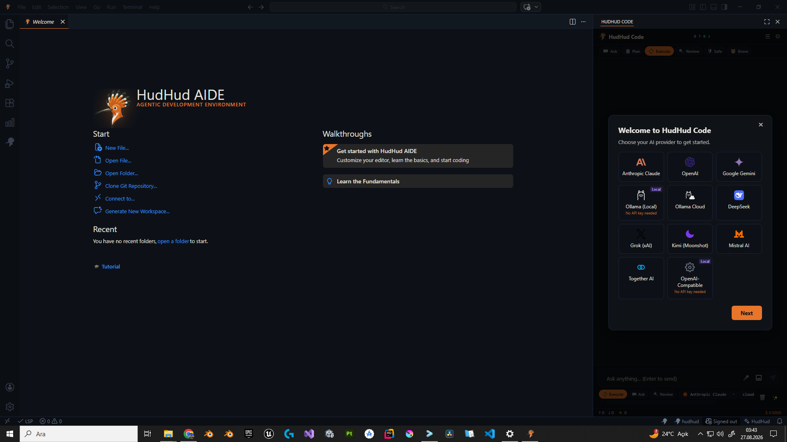
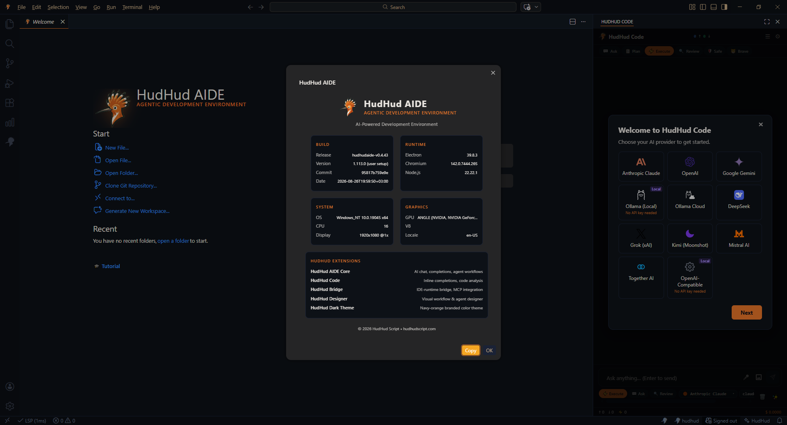

# HudHud AIDE: Otonom Akıllı Geliştirme Ortamı

<p align="center">
  <b>Languages:</b> <a href="../README.md">English</a> | <b>Türkçe</b> | <a href="README.ar.md">العربية</a> | <a href="README.ja.md">日本語</a> | <a href="README.ru.md">Русский</a> | <a href="README.es.md">Español</a> | <a href="README.pt.md">Português</a> | <a href="README.zh.md">简体中文</a>
</p>

<p align="center">
  <a href="INSTALL.tr.md"><b>📖 Kurulum Kılavuzu</b></a> | 
  <a href="ONBOARDING.tr.md"><b>🚀 İlk Çalıştırma & Başlangıç</b></a>
</p>

---

[](https://github.com/HudHudMind/hudhud-aide/releases/tag/v0.4.46)
[](https://github.com/HudHudMind/hudhudscript)
[-green.svg)](https://github.com/HudHudMind/hudhudscript)

<p align="center">
  
</p>

**HudHud AIDE**, temelde [**HudHudScript**](https://github.com/HudHudMind/hudhudscript) dili için geliştirilmiş, aynı zamanda yerleşik kod editörü ve yapay zekâ kodlama ajanı aracılığıyla **Python, Rust, C/C++, TypeScript/JavaScript** gibi yaygın programlama dillerinde de geliştirme yapılmasına olanak tanıyan bir tümleşik geliştirme ortamıdır (IDE).

Sistem iki temel çalışma modelini birleştirir:
* **Kaynak Kod Düzenleme ve Ajan Desteği:** Çalışma alanı farkındalığına sahip yapay zekâ kodlama ajanı ile farklı dillerde kaynak kod yazımı, hata ayıklama ve refactoring.
* **Görsel Programlama (`.hudhudgraph`):** Düğüm tabanlı görsel programlama yapısıyla, doğrudan **HudHudScript** mantık akışlarını, ajan boru hatlarını ve sistem mimarisini modelleme ve kod üretme.

HudHud AIDE, **geleneksel yazılım geliştirme ile modern paradigmaları** tek bir yapıda buluşturur:
* **Ajanik Programlama (Agentic Programming):** Otonom ajanların, rollerin, araç entegrasyonlarının ve çoklu ajan koordinasyonunun tanımlanması ve geliştirilmesi.
* **Döngü Mühendisliği ve Döngü Zincirleri (Loop Engineering & Loop Chains):** Doğrulama, geri bildirim ve yinelemeli iyileştirme adımlarını içeren yürütme döngülerinin kurgulanması.
* **Yönetişim (Governance):** Ajanların çalışma sınırlarını, politika kurallarını ve izin matrislerini kod ve grafik seviyesinde denetleme.
* **Özne Yönelimli Programlama (SOP):** Yazılım mimarisini nesneler yerine bağlamlar, niyetler ve aktif özneler etrafında modelleme.

Geliştiriciler; görsel programlama arayüzünü kullanarak, doğrudan kaynak kod yazarak veya yerleşik kodlama ajanından yararlanarak kendi yapay zekâ ajanlarını ve sistem mimarilerini yapılandırabilirler.

---

## Temel Yeteneklere Genel Bakış

```
┌─────────────────────────────────────────────────────────────────────────────┐
│                                 HudHud AIDE                                 │
├───────────────────┬─────────────────────┬─────────────────┬─────────────────┤
│Görsel Programlama │ HudHud Coding Agent │   HudHud Code   │  HudHudScript   │
│  (.hudhudgraph    │ (Otonom Çok Dosyalı │(İnteraktif YZ   │ (Donanıma Uyumlu│
│   Düğüm Sistemi)  │    Refactoring)     │  Kod Eşlikçisi) │Yerel Çalıştırıcı│
└───────────────────┴─────────────────────┴─────────────────┴─────────────────┘
```

* **Görsel Mimari ve Mantık Modelleme:** Uygulama akışlarını, ajan boru hatlarını ve durum yapılarını düğüm tabanlı görsel programlama ile modelleyin.
* **HudHud Coding Agent:** Çalışma alanınızdaki birden çok dosyayı analiz eden, düzenleyen, araçları çalıştıran ve hataları çözen otonom yapay zekâ kodlama ajanı.
* **HudHud Code:** Kod tabanınızla derinlemesine sohbet etmenizi, mimari planlamanızı, model seçmenizi ve anlık çift programlama yapmanızı sağlayan etkileşimli YZ eşlikçisi.
* **HudHudScript Dil Paradigmaları Desteği:** Agentic Programming, Loop Engineering, Yönetişim (Governance) kuralları ve Özne Yönelimli Programlama (SOP) için tam yerel destek.
* **Hazır ve Donanım Optimizasyonlu Araç Takımı:** İşlemcinizin donanım yeteneklerine (`x86-64-v1` to `v4`) göre kurulumda otomatik yapılandırılan derleyici, yorumlayıcı, LSP ve paket yöneticisi.

---

## Görsel Programlama ve HudHudGraphs

HudHud AIDE'deki **Görsel Programlama**, kaynak kodunuzla eşzamanlı olarak yazılım mimarilerini ve iş akışlarını görsel olarak tasarlamak ve incelemek için etkileşimli bir tuval sunar.

Görsel mimariler standart **`.hudhudgraph`** dosyalarında saklanır.

<p align="center">
  
</p>

```
                    ┌─────────────────────────┐
                    │       Agent Node        │
                    ├───────────┬─────────────┤
                    │ Role      │ Governance  │
                    │ Tools     │ Validation  │
                    └─────┬─────┴──────┬──────┘
                          │            │
                          ▼            ▼
                   [ Action / Loop ] [ Policy ]
```

<p align="center">
  
</p>

### Yetenekler:
* **240+ Özelleştirilmiş Düğüm Türü:** Uygulama akışı, ajan tanımları, veri boru hatları, durum makineleri, yönetişim kuralları ve arayüz ilişkilerini kapsayan hazır düğümler.
* **Tipli Pin Bağlantıları:** Tip güvenli pin doğrulaması ile açık veri kanalları ve yürütme akışları.
* **Özellikler Denetçisi:** Parametrelerini, davranışlarını ve özniteliklerini anlık yapılandırmak için dilediğiniz düğümü seçin.
* **Hibrit İş Akışı:** Zorunlu kod üretimi yükü olmadan standart `.hud` kaynak kodlarıyla görsel `.hudhudgraph` dosyalarını yan yana kullanın.

### Nasıl Kullanılır:
1. Çalışma alanınızda bir `.hudhudgraph` dosyası açın veya oluşturun.
2. Editör sekmesinde **"Open with Visual Designer"** seçeneğine tıklayın.
3. Sol **Palet**'ten düğümleri tuval üzerine sürükleyin.
4. Düğümler arasındaki yürütme yollarını ve veri pinlerini bağlayın.
5. Sağ denetçi panelinde düğüm özelliklerini düzenleyin ve kaydedin (`Ctrl + S` / `Cmd + S`).

---

## HudHud Coding Agent

**HudHud Coding Agent**, doğrudan kod deponuz üzerinde çok dosyalı yazılım geliştirme, düzenleme ve hata ayıklama görevlerini yerine getirmek üzere tasarlanmış otonom bir yapay zekâ eşlikçisidir.

<p align="center">
  
</p>

### Otonom Kodlama Yetenekleri:
* **Çok Dosyalı Kod Geliştirme & Refactoring:** Tek bir komutla birden fazla dosya üzerinde yeni özellikler yazar, bağımlılıkları günceller ve mimariyi refactor eder.
* **Çalışma Alanı Analizi:** Kaynak dosyaları, proje yapılandırmalarını ve `.hudhudgraph` görsel mimarilerini derinlemesine okur ve analiz eder.
* **Tanılama ve Hata Çözümü:** Derleyici uyarılarını, çalışma zamanı istisnalarını ve tip hatalarını tespit ederek otomatik olarak doğrulanmış çözümler üretir.
* **Görev Otomasyonu:** Çok adımlı mühendislik planlarını, test yürütmelerini ve proje geçişlerini otonom olarak takip eder.
* **İnteraktif Fark (Diff) ve Araç Onaylama:** Dosya değişiklikleri diske yazılmadan önce satır içi farkları inceleme, onaylama veya reddetme imkânı tanır.

<p align="center">
  
</p>

---

## HudHud Code

**HudHud Code**, HudHud AIDE içerisine doğrudan entegre edilmiş etkileşimli yapay zekâ eşlikçisi ve zekâ merkezidir. Kod tabanınızla doğal dilde sohbet etmenizi, mimari planlama yapmanızı ve modeller arasında anında geçiş yapmanızı sağlar.

<p align="center">
  
</p>

### Etkileşimli Yetenekler:
* **Kod Tabanı ve Mimari Sorguları:** Tüm projenizin bağlamını gözeterek mantık akışları, ajan etkileşimleri ve `.hudhudgraph` hatları hakkında derinlemesine sorular sorun.
* **Çoklu Model Desteği:** En gelişmiş kodlama modelleri (Anthropic Claude 3.5 Sonnet, OpenAI GPT-4o, Google Gemini 1.5 Pro, DeepSeek) veya Ollama üzerinden yerel LLM'ler arasında dilediğiniz an geçiş yapın.
* **Özel Talimatlar ve Parametre Kontrolü:** Sohbet başına akıl yürütme tarzı, belirteç limitleri, sistem talimatları ve sıcaklık (temperature) ayarlarını özelleştirin.
* **Yapılandırılabilir Araç İzinleri:** Otomatik araç çağırma (dosya okuma, terminal komutu çalıştırma, grafik üretme) izinlerini ayrıntılı olarak yönetin.

<p align="center">
  
</p>

<p align="center">
  
</p>

---

## HudHudScript Dil ve Paradigma Desteği

HudHud AIDE, [**HudHudScript**](https://github.com/HudHudMind/hudhudscript) dilinin temel paradigmalarını yerel olarak anlayacak ve destekleyecek şekilde tasarlanmıştır:

* **Ajanik Programlama (Agentic Programming):** Otonom ajanları, rolleri, sorumlulukları, araçları ve çoklu ajan etkileşimlerini tanımlamak için dil düzeyinde yapılar.
* **Döngü Mühendisliği (Loop Engineering):** Eylemleri, doğrulamaları ve yinelemeli iyileştirmeleri birleştiren yapılandırılmış, geri bildirim odaklı yürütme döngüleri.
* **Yönetişim Sistemleri (Governance):** Rolleri, kuralları, kısıtlamaları, konseyleri ve izinleri doğrudan kod ve grafiklerde tanımlamak için yerleşik yapılar.
* **Özne Yönelimli Programlama (SOP):** Özneler, bağlamlar ve davranışsal sorumluluklar etrafında odaklanan yazılım modellemesi.

---

## Yerel HudHudScript Araç Takımı

HudHud AIDE eksiksiz yerel araç takımıyla birlikte gelir. Kurulum sırasında ortam işlemcinizin özelliklerini (SSE4.2, AVX2, AVX-512) algılar ve en uygun ikili seti (`x86-64-v1` to `v4`) etkinleştirir:

| İkili / Araç | Görev |
| :--- | :--- |
| **`hudhud`** | Komut satırı (CLI) çalışma zamanı ve uygulama yürütücüsü |
| **`hudc`** | Optimize edici yerel HudHudScript derleyicisi |
| **`hudi`** | Etkileşimli REPL kabuğu ve canlı yorumlayıcı |
| **`hudconv`** | AST, bayt kodu ve şema taşıma aracı |
| **`hudhudscript-lsp`** | Sözdizimi vurgulama, otomatik tamamlama ve üzerine gelme belgelerini sağlayan LSP motoru |
| **`hudhud_ffi`** | C / Rust Yabancı Fonksiyon Arayüzü (FFI) çalışma zamanı |

---

## Bütünleşik Geliştirme İş Akışı

```
   1. Görsel Programlama     2. Uygulama                3. Doğrulama
 ┌──────────────────┐      ┌──────────────────┐      ┌──────────────────┐
 │ Model Grafiği    │ ───► │ YZ Kodlama Ajanı │ ───► │ Derle, Test Et   │
 │ (.hudhudgraph)   │      │ ile Kod Yazımı   │      │ ve Çalıştır      │
 └──────────────────┘      └──────────────────┘      └──────────────────┘
```

1. **Modelleme:** Görsel Programlama kullanarak mantığınızı, ajanlarınızı veya veri akışınızı görsel olarak kurgulayın.
2. **Uygulama:** HudHudScript kodu yazın veya iş mantığı ve işleyicileri uygulamak için entegre Kodlama Ajanı ile çalışın.
3. **Çalıştırma ve Hata Ayıklama:** Yerel araç takımı ikililerini ve etkileşimli hata ayıklama araçlarını kullanarak doğrudan IDE içinde çalıştırın ve hata ayıklayın.

---

## Sistem Gereksinimleri ve Kurulum

Güncel kurulum paketlerini [GitHub Releases](https://github.com/HudHudMind/hudhud-aide/releases/tag/v0.4.46) sayfasından veya aşağıdaki doğrudan bağlantılardan indirebilirsiniz:

### Windows (x64)
* **İşletim Sistemi:** Windows 10 / 11 (64-bit)
* **İndir:** [`hudhud-aide-v0.4.46-win-x64-setup.exe`](https://github.com/HudHudMind/hudhud-aide/releases/download/v0.4.46/hudhud-aide-v0.4.46-win-x64-setup.exe)
* **SmartScreen / Kurulum Adımı:**
  Kurulum dosyası henüz dijital olarak imzalanmadığı için Windows Defender SmartScreen *"Windows kişisel bilgisayarınızı korudu"* uyarısı verebilir:
  1. Açılan pencerede **"Ek bilgi"** (*More info*) bağlantısına tıklayın.
  2. Ardından **"Yine de çalıştır"** (*Run anyway*) butonuna basarak kuruluma devam edin.
* *Kurulum aracı, CPU mimarinize uygun ikili seviyesini (`v1` to `v4`) otomatik olarak yapılandırır.*

### Linux (x86_64)
* **İşletim Sistemi:** Ubuntu 20.04+, Debian 11+, Fedora, Arch Linux, Kali Linux
* **İndir:** [`hudhud-aide-v0.4.46-linux-x64-installer.run`](https://github.com/HudHudMind/hudhud-aide/releases/download/v0.4.46/hudhud-aide-v0.4.46-linux-x64-installer.run)
* **Kurulum:**
  ```bash
  chmod +x hudhud-aide-v0.4.46-linux-x64-installer.run
  ./hudhud-aide-v0.4.46-linux-x64-installer.run
  ```

---

## Topluluk ve Bağlantılar

* **Web Sitesi:** [https://hudhudscript.com](https://hudhudscript.com)
* **GitHub (HudHudScript):** [https://github.com/HudHudMind/hudhudscript](https://github.com/HudHudMind/hudhudscript)
* **GitHub (HudHud AIDE):** [https://github.com/HudHudMind/hudhud-aide](https://github.com/HudHudMind/hudhud-aide)
* **Discord:** [https://discord.gg/UxEJ5MfH](https://discord.gg/UxEJ5MfH)
* **Reddit:** [https://www.reddit.com/r/hudhudscript/](https://www.reddit.com/r/hudhudscript/)
* **Twitter / X:** [https://x.com/hudhud_script](https://x.com/hudhud_script)
* **Instagram:** [https://www.instagram.com/hudhudscript/](https://www.instagram.com/hudhudscript/)
* **TikTok:** [https://www.tiktok.com/@hudhudscript](https://www.tiktok.com/@hudhudscript)
* **YouTube:** [https://www.youtube.com/@HudHudScripting](https://www.youtube.com/@HudHudScripting)
* **LinkedIn:** [https://www.linkedin.com/groups/27050016/](https://www.linkedin.com/groups/27050016/)
* **Patreon:** [https://www.patreon.com/cw/hudhudscript](https://www.patreon.com/cw/hudhudscript)

---

## Lisans ve İletişim

<p align="center">
  
</p>

HudHud AIDE, **HudHud Script** tarafından geliştirilen profesyonel bir geliştirme ortamıdır.

* **Depo:** [https://github.com/HudHudMind/hudhudscript](https://github.com/HudHudMind/hudhudscript)

---
*© 2026 HudHud Script. Tüm hakları saklıdır.*
